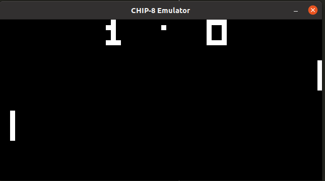

# CHIP-8 emulator

[CHIP-8](https://en.wikipedia.org/wiki/CHIP-8) emulator in Rust with graphics and audio via [SDL2](https://docs.rs/sdl2/0.34.5/sdl2/).

Based on [the great reference page by by Cowgod](http://devernay.free.fr/hacks/chip8/C8TECH10.HTM)
